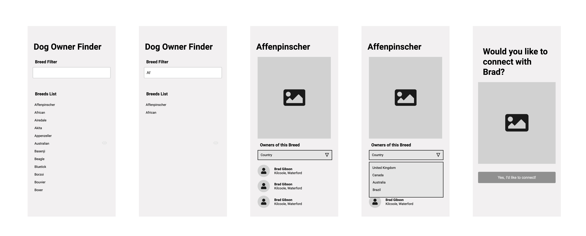

# Thrivos Fullstack Developer Challenge

This repo contains a code challege for candidates applying for
the position of Fullstack Developer (Node + React) with Thrivos.

# Goal

The goal of this challenge is to build a tiny application (both
frontend and backend) that can lets users find dog owners in 
different countries for a specific breed.

# Running the Projects

To run the frontend do:
1. `cd frontend`
2. `npm ci` or `npm install`
3. `npm start`
4. Dev server will start in port 3000

To run the backend:
1. `cd backend`
2. `npm ci` or `npm install`
3. `npm start`
4. Server should start in port 3001

# Challenge Requirements

A wireframe of the application we're trying to build can be seen
in the following image. The goal is to build as much of the app as possible.

To find the information of the dog breeds we will use the free [Dogs API](https://dog.ceo/dog-api/documentation/) and to find the owners information we will use the
[Random User API](https://randomuser.me/).

1. The home screen must show the list of dog breeds available.
    1. The list of breeds can be obtained from the endpoint https://dog.ceo/api/breeds/list/all doing a GET request.
    2. When the user writes into the Breed Filter input the list must be filtered to show only breeds that match what was written (shown in the second screen in the image).
    3. If the user clicks on any breed the app should take them to the third page (shown in the image above).

2. In the third page we need to show the breed's name, an image of that breed and below a list of people who own that breed.
    1. The image of the breed can be obtained by calling the endpoint `https://dog.ceo/api/breed/<breed>/images/random` where `<breed>` is the name of the breed that user is viewing currently (in the example of the image the call should be https://dog.ceo/api/breed/affenpinscher/images/random). This will return a JSON with the actual link to the image. That image link should be returned to the frontend to display.
    2. To create the owners list we can call the endpoint https://randomuser.me/api/?results=5.
    3. In the owner list we must show, for each user, the following fields from the API response:
     - `name.first`
     - `name.last`
     - `location.city`
     - `location.country`
     - `picture.thumbnail`
3. If the user selects a specific country in the dropdown, the app must re-fetch the owners list filtering that country only.
    1. In order to fetch specific countries you can call the endpoint:
        - https://randomuser.me/api/?results=5&nat=gb
    2. The allowed nationalities are: AU, BR, CA, CH, DE, DK, ES, FI, FR, GB, IE, IR, NO, NL, NZ, TR, US. A map of names to codes is already provided in `frontend/src/helpers/countries.js`.
4. Once the user clicks on an owner of the list they must be taken to the last page where they are offered to connect with that user. Clicking on the page's button does nothing.

# Bonus Questions

1. Which optimizations would you propose to make the application run faster?
2. If clicking on that button "Yes, I'd like to connect with X" were to send an email to that owner asking to connect, how would you design that functionality on the backend?
